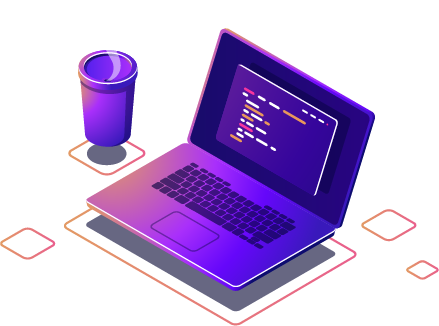

## Olá mundo 👋

Oi me chamo Gustavo, sou desenvolvedor full-stack, atualmente trabalho com java e angular.

### Linguagens 

Java, Angular, PHP, HTML, CSS, JS

### Banco de dados

MySql, Oracle 

  <a href="https://github.com/GustavoMMartins">
  
  

  
          

  
  

